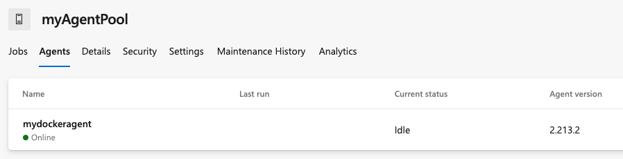

# Azure DevOps Docker Containers for Self-Hosted Agents

This repo contains code samples used in [Run a self-hosted agent in Docker](https://learn.microsoft.com/en-us/azure/devops/pipelines/agents/docker?view=azure-devops).

## Ubuntu 20.04 agent

### Prerequisites

* Create a personal access token with read/write permission for Agent Pools
* Create a new agent pool at the organization-level with the name `myAgentPool`

To set up a local self-hosted agent, you'll first build your Docker image and then run the container. When the container is running, you'll install the Azure Pipelines agent.  

1. Go to `ubuntu/dockeragent` and build your container.

    ```code
    docker build -t dockeragent:latest .
    ```

2. Install the latest version of the pipelines agent. Then, configures and run the agent. The agent script targets the `myAgentPool` pool of a specified Azure DevOps or Azure DevOps Server instance of your choice. Replace the `<PAT token>` and`<Azure DevOps instance>` values. Your PAT token needs to have read and write permission for agent pools.

    ```code
    docker run -e AZP_URL=<Azure DevOps instance> -e AZP_TOKEN=<PAT token> -e AZP_POOL=myAgentPool -e AZP_AGENT_NAME=mydockeragent dockeragent:latest
    ```

    If you want a fresh agent container for every pipeline job, pass the `--once` flag to the run command.

3. Go to the **Agent** tab within your Agent Pool and verify that the agent is running.

    

4. Update an existing Azure Pipeline YAML file to use your new agent.

    ```yml
        pool:
          name: myAgentPool   
    ```

5. Run your pipeline and verify that the run completes successfully.

### Push the dockeragent image to Azure Container Registry 

1. Create an Azure Container Registry if you do not have one already. If you need to create a container registry, see  [this quickstart](https://learn.microsoft.com/azure/container-registry/container-registry-get-started-portal?tabs=azure-cli).

2.  Log in to Azure Container Registry locally. 

    ```code
    az acr login --name <acrname>
    ```
3. Tag your Docker image.

    ```
    docker tag dockeragent <registry-name>.azurecr.io/dockeragent:v1
    ```

4. Push the image to Azure Container Registry. 

    ```code
    docker push <registry-name>.azurecr.io/dockeragent:v1
    ```

### Create a Azure Container Instance from the image

1. Create a new Agent Pool, for example `myACIAgentPool`.

2. Create a new container instance and pass the following environment variables. *This step should be replaced by [secure values](https://learn.microsoft.com/azure/container-instances/container-instances-environment-variables)*. 

    * AZP_TOKEN: Your Azure DevOps personal access token
    * AZP_AGENT_NAME: Name of the Azure DevOps Agent (example: `myUbuntuAgent`)
    * AZP_POOL: Name of the Azure DevOps Agent Pool (example: `MyACIAgentPool`)
    * AZP_URL: URL for your Azure DevOps organization (example: `https://dev.azure.com/fabrikam`)

    ```code
    az container create \
        --resource-group <resource-group> \
        --name <ACI-name> \
        --image <ACR-name>.azurecr.io/dockeragent:v1 \
        --dns-name-label aci-acr-demo --ports 80 \
        --environment-variables 'AZP_TOKEN'='<PAT>’ 'AZP_AGENT_NAME’=‘<AGENT_NAME>’ 'AZP_POOL'='MyACIAgentPool' 'AZP_URL'='https://dev.azure.com/fabrikam' 
    ```

3. Check logs to make sure your container is running. 

    ```code
    az container attach --resource-group <resource-group> --name <aci-name>
    ```

4. Update an existing Azure Pipeline YAML file to use your new agent.

    ```yml
        pool:
          name: myACIAgentPool   
    ```

5. Run your pipeline and verify that the run completes successfully.
